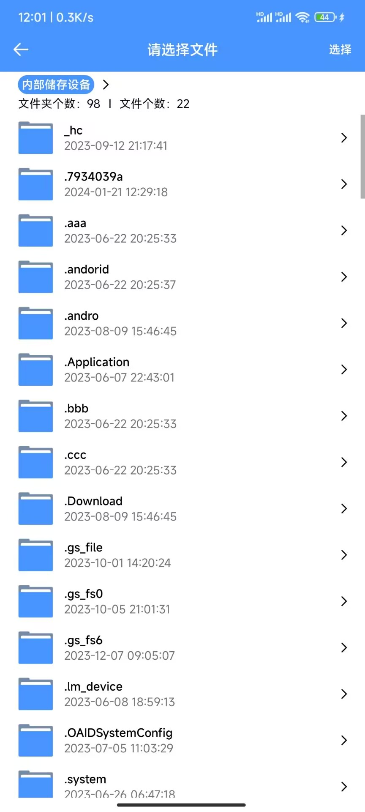
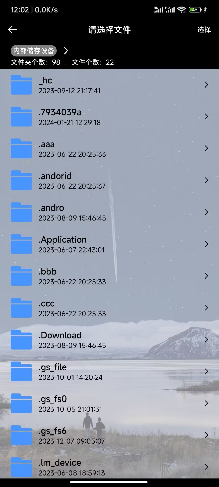
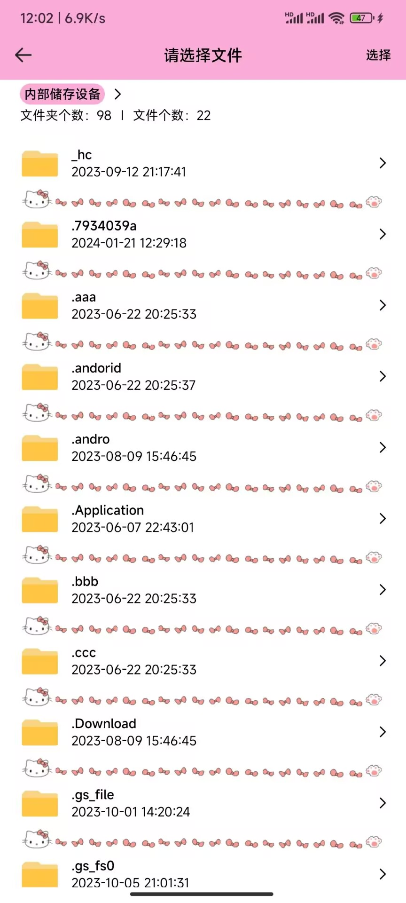
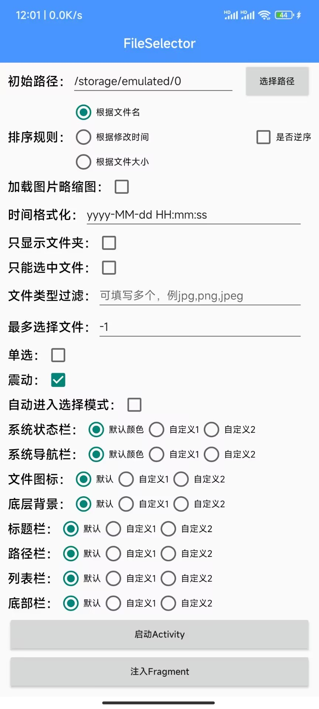
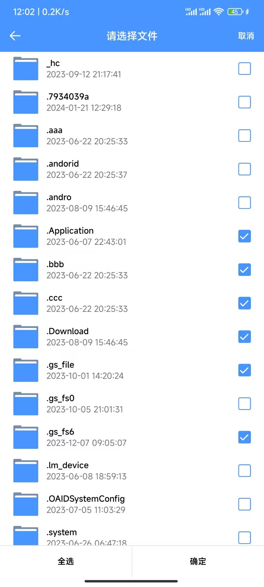
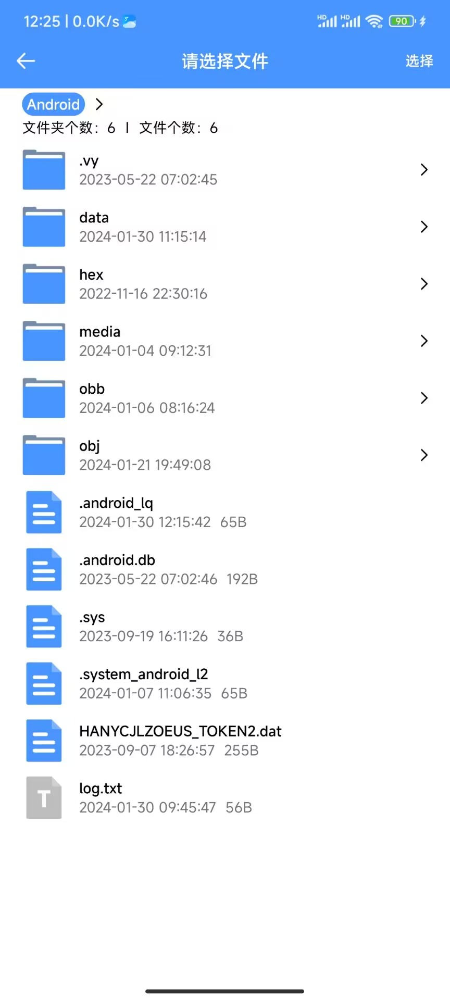
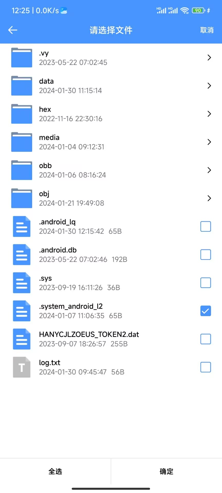

# FileSelector 1.0.0

## 目录

- [引用方式](#引用方式)<br>
- [调用方式](#启动方式)<br>
- [操作文件](#操作文件)<br>
- [基本使用](#基本使用)<br>
- [进阶使用](#进阶使用)<br>
- [体验demo](#体验demo)<br>
- [功能演示](#功能演示)<br>

## 引用方式

`Gradle 7.0`以下，需要在项目级`build.gradle`文件中加入

```sh
allprojects {
    repositories {
        ...
        maven { url 'https://jitpack.io' }
    }
}
```

`Gradle 7.0`以上，需要在`setting.gradle`文件中加入

```sh
dependencyResolutionManagement {
	repositories {
		...
		maven { url 'https://jitpack.io' }
	}
}
```

远程仓库配置之后，即可在模块的`build.gradle`中引入`FileSelector`

```sh
dependencies {
    implementation 'com.github.xxinPro:FileSelector:1.0'
}
```

## 启动方式

1、启动`Activity`

```java
FileSelector.create(this)
        .forResult(new OnResultCallbackListener() {
            @Override
            public void onResult(List<FileBean> result) {
                // 文件处理逻辑
            }

            @Override
            public void onCancel() {
                // 未选择处理逻辑
            }
        });
```

2、注入`frameLayout`，其中`forResult()`的第一个参数代表需要被注入的`frameLayout`的`id`

```java
FileSelector.create(this)
        .forResult(R.id.frame_layout, new OnResultCallbackListener() {
            @Override
            public void onResult(List<FileBean> result) {
                // 文件处理逻辑
            }

            @Override
            public void onCancel() {
                // 未选择处理逻辑
            }
        });
```

## 操作文件

在选择文件后，`FileSelector`将回调`OnResultCallbackListener`的`onResult()`方法，在`onResult()`方法中通过`List<FileBean>`集合可对文件进行操作

对于`FileBean`类，其中仅包含一个可用的`File`或`DocumentFile`类型文件对象，因为在`Android 11`及以上的系统中，`data`或`obb`目录中的子文件是`DocumentFile`类型文件对象

可以通过如下方法判断`FileBean`中包含的文件类型

| 方法名                                 | 返回结果                                                          |
|-------------------------------------|---------------------------------------------------------------|
| public boolean isFileType()         | 为`true`时表示`FileBean`中包含一个`File`类型文件对象，反之为`DocumentFile`类型文件对象 |
| public boolean isDocumentFileType() | 为`true`时表示`FileBean`中包含一个`DocumentFile`类型文件对象，反之为`File`类型文件对象 |

通过如下方法可以获取`FileBean`中包含的`File`或`DocumentFile`文件对象

| 方法名                                   | 返回结果                                 |
|---------------------------------------|--------------------------------------|
| public File getFile()                 | 获取`FileBean`中包含的`File`类型文件对象         |
| public DocumentFile getDocumentFile() | 获取`FileBean`中包含的`DocumentFile`类型文件对象 |

通过如下方法可以对`FileBean`类进行一些快捷操作

| 方法名                        | 返回结果                    |
|----------------------------|-------------------------|
| public long lastModified() | 取`FileBean`中包含文件的最后修改时间 |
| public long length()       | 取`FileBean`中包含文件的大小     |
| public String getName()    | 取`FileBean`中包含文件的文件名    |

## 基本使用

### 设置起始路径

设置文件选择器打开的起始路径，默认起始路径为`/storage/emulated/0`，可以自定义设置为任何一个存在的路径，包括`data(obb)`目录及其子目录，若`data(obb)`目录或其子目录没有访问权限将会自动申请

```java
FileSelector.create(this)
        .setInitPath(Environment.getExternalStorageDirectory().getAbsolutePath())   // 设置起始路径
        .forResult(new OnResultCallbackListener() {
            @Override
            public void onResult(List<FileBean> result) {
                // 文件处理逻辑
            }

            @Override
            public void onCancel() {
                // 未选择处理逻辑
            }
        });
```

### 设置排序规则

设置文件列表的排序规则，默认根据文件名排序

```java
FileSelector.create(this)
        .setSortRule(SortRule.Name) // 设置排序规则
        .forResult(new OnResultCallbackListener() {
            @Override
            public void onResult(List<FileBean> result) {
                // 文件处理逻辑
            }

            @Override
            public void onCancel() {
                // 未选择处理逻辑
            }
        });
```

`setSortRule()`重载方法的第二个参数用于控制是否逆序，为`true`时代表逆序

```java
FileSelector.create(this)
        .setSortRule(SortRule.Name, true) // 设置排序规则，并进行逆序
        .forResult(new OnResultCallbackListener() {
            @Override
            public void onResult(List<FileBean> result) {
                // 文件处理逻辑
            }

            @Override
            public void onCancel() {
                // 未选择处理逻辑
            }
        });
```

`FileSelector`提供了如下三种排序规则

```java
public enum SortRule {
    Time,   // 按时间排序
    Name,   // 按文件名排序
    Size,   // 按大小排序
}
```

若不满足，可以使用自定义的排序规则；需要注意的是，设置自定义排序规则后`FileSelector`中的排序规则将不生效

```java
FileSelector.create(this)
        .selfSortRule(new Comparator<FileItemBean>() {
            @Override
            public int compare(FileItemBean o1, FileItemBean o2) {
                // 自定义排序逻辑
                return 0;
            }
        })
        .forResult(new OnResultCallbackListener() {
            @Override
            public void onResult(List<FileBean> result) {
                // 文件处理逻辑
            }

            @Override
            public void onCancel() {
                // 未选择处理逻辑
            }
        });
```

### 自定义文件图标

`FileSelector`提供了默认的文件图标，若不满足可以对文件图标进行自定义设置

#### 未知文件图标

`FileSelector`通过文件的后缀名来设置对应的图标，所以当文件有一些不明所以的后缀名时，`FileSelector`将会为其设置一个未知文件图标，通过如下代码可以对该图标进行自定义

```java
FileSelector.create(this)
        .setDefaultFileIcon(R.drawable.file_icon) // 设置未知文件的图标
        .forResult(new OnResultCallbackListener() {
            @Override
            public void onResult(List<FileBean> result) {
                // 文件处理逻辑
            }

            @Override
            public void onCancel() {
                // 未选择处理逻辑
            }
        });
```

#### 文件夹图标

自定义文件夹图标

```java
FileSelector.create(this)
        .setDefaultFolderIcon(R.drawable.folder_icon) // 设置文件夹的图标
        .forResult(new OnResultCallbackListener() {
            @Override
            public void onResult(List<FileBean> result) {
                // 文件处理逻辑
            }

            @Override
            public void onCancel() {
                // 未选择处理逻辑
            }
        });
```

#### 给指定类型文件添加图标

`FileSelector`给小部分常见文件添加了图标，例如`jpg`、`png`，若对此图标不满足或想添加其他类型文件的图标，可以通过如下方式

```java
FileSelector.create(this)
        .addIconBySuffix("jpg", R.drawable.img_icon)    // 给指定类型文件添加图标
        .addIconBySuffix("png", R.drawable.img_icon)    // 给指定类型文件添加图标
        .addIconBySuffix("mp3", R.drawable.music_icon)  // 给指定类型文件添加图标
        .forResult(new OnResultCallbackListener() {
            @Override
            public void onResult(List<FileBean> result) {
                // 文件处理逻辑
            }

            @Override
            public void onCancel() {
                // 未选择处理逻辑
            }
        });
```

批量添加公用同一图标的文件类型，如下代码将`jpg`、`png`、`webp`的图标设置为`R.drawable.img_icon`

```java
FileSelector.create(this)
        .addBatchesIconBySuffix(
            new String[] {"jpg", "png", "webp"}, R.drawable.img_icon)
        .forResult(new OnResultCallbackListener() {
            @Override
            public void onResult(List<FileBean> result) {
                // 文件处理逻辑
            }

            @Override
            public void onCancel() {
                // 未选择处理逻辑
            }
        });
```

批量添加，需要文件类型后缀名和图标两个数组，注意后缀名和图标的下标需一一对应

```java
FileSelector.create(this)
        .addBatchesIconBySuffix(
            new String[] {"jpg", "png", "mp3"},
            new int[] {R.drawable.img_icon, R.drawable.img_icon, R.drawable.music_icon})
        .forResult(new OnResultCallbackListener() {
            @Override
            public void onResult(List<FileBean> result) {
                // 文件处理逻辑
            }

            @Override
            public void onCancel() {
                // 未选择处理逻辑
            }
        });
```

### 加载略缩图

开启略缩图加载后，图片、GIF图片以及视频的图标将显示一个略缩图，但是加载略缩图需要加载引擎，可以参考使用`Glide`实现的[GlideEngine](./app/src/main/java/xyz/xxin/fileselect/engine/GlideEngine.java)

```java
FileSelector.create(this)
        .isDisplayThumbnail(true)   // 开启略缩图加载
        .setImageEngine(GlideEngine.createGlideEngine()) // 设置略缩图加载引擎
        .forResult(new OnResultCallbackListener() {
            @Override
            public void onResult(List<FileBean> result) {
                // 文件处理逻辑
            }

            @Override
            public void onCancel() {
                // 未选择处理逻辑
            }
        });
```

### 文件修改时间的格式

`FileSelector`中默认的文件修改时间的显示格式是`2024-01-01 12:30:26`，可以通过如下方式修改

```java
FileSelector.create(this)
        .setLastModifiedPattern("yyyy年MM月dd日 HH时mm分ss秒") // 设置文件最后修改时间的显示格式
        .forResult(new OnResultCallbackListener() {
            @Override
            public void onResult(List<FileBean> result) {
                // 文件处理逻辑
            }

            @Override
            public void onCancel() {
                // 未选择处理逻辑
            }
        });
```

### 只显示文件夹

设置文件列表中只显示文件夹，不显示文件

```java
FileSelector.create(this)
        .isOnlyDisplayFolder(true)  // 只显示文件夹
        .forResult(new OnResultCallbackListener() {
            @Override
            public void onResult(List<FileBean> result) {
                // 文件处理逻辑
            }

            @Override
            public void onCancel() {
                // 未选择处理逻辑
            }
        });
```

### 只选择文件

设置只能选择文件，禁止选择文件夹

```java
FileSelector.create(this)
        .isOnlySelectFile(true) // 只能选择文件
        .forResult(new OnResultCallbackListener() {
            @Override
            public void onResult(List<FileBean> result) {
                // 文件处理逻辑
            }

            @Override
            public void onCancel() {
                // 未选择处理逻辑
            }
        });
```

### 显示指定类型文件

设置仅显示指定类型的文件，如下代码设置后，将仅显示`jpg`、`txt`、`mp3`类型的文件

```java
FileSelector.create(this)
        .addDisplayType("jpg", "txt", "mp3")    // 仅显示指定类型文件
        .forResult(new OnResultCallbackListener() {
            @Override
            public void onResult(List<FileBean> result) {
                // 文件处理逻辑
            }

            @Override
            public void onCancel() {
                // 未选择处理逻辑
            }
        });
```

### 设置最大选择数

如下代码设置后，在选择文件时最多只能选择`5`个，达到上限后无法继续选择其他文件

```java
FileSelector.create(this)
        .setMaxSelectValue(5)    // 设置文件最大选择数
        .forResult(new OnResultCallbackListener() {
            @Override
            public void onResult(List<FileBean> result) {
                // 文件处理逻辑
            }

            @Override
            public void onCancel() {
                // 未选择处理逻辑
            }
        });
```

设置最大选择数可以添加一个`文件选择回调`，选中某`item`时会回调该方法，该方法提供了两个参数

- `int maxSelectCount`：最大选择数
- `int currentSelectCount`：已选择的个数

```java
FileSelector.create(this)
        // 设置文件最大选择数，同时设置一个文件选择回调
        .setMaxSelectValue(5, new OnSelectCallBackListener() {
            @Override
            public void onSelectCallBack(int maxSelectCount, int currentSelectCount) {
                if (currentSelectCount >= maxSelectCount) {
                    Toast.makeText(SelectActivity.this, "选择达到上限，最多选择" + maxSelectCount + "个文件~", Toast.LENGTH_SHORT).show();
                }
            }
        })
        .forResult(new OnResultCallbackListener() {
            @Override
            public void onResult(List<FileBean> result) {
                // 文件处理逻辑
            }

            @Override
            public void onCancel() {
                // 未选择处理逻辑
            }
        });
```

### 设置单选模式

在设置单选模式后，将仅能选择一个文件或文件夹；单选模式不同于设置最大选择数为`1`，具体区别请自行测试

```java
FileSelector.create(this)
        .isSingle(true)     // 设置为单选模式
        .forResult(new OnResultCallbackListener() {
            @Override
            public void onResult(List<FileBean> result) {
                // 文件处理逻辑
            }

            @Override
            public void onCancel() {
                // 未选择处理逻辑
            }
        });
```

### 开启震动

默认为开启状态，选择文件或文件夹时将轻微震动手机

```java
FileSelector.create(this)
        .isVibrator(true)   // 开启震动
        .forResult(new OnResultCallbackListener() {
            @Override
            public void onResult(List<FileBean> result) {
                // 文件处理逻辑
            }

            @Override
            public void onCancel() {
                // 未选择处理逻辑
            }
        });
```

### 自动打开选择模式

开启后，在进入文件选择页面时将自动打开文件选择模式

```java
FileSelector.create(this)
        .isAutoOpenSelectMode(true) // 自动打开选择模式
        .forResult(new OnResultCallbackListener() {
            @Override
            public void onResult(List<FileBean> result) {
                // 文件处理逻辑
            }

            @Override
            public void onCancel() {
                // 未选择处理逻辑
            }
        });
```

### 设置状态栏颜色

设置状态栏的颜色在`fragment`注入模式下同样生效，所以在选择文件之后可能需要重新设置`frameLayout`所属`Activity`的状态栏颜色

```java
FileSelector.create(this)
        .setStatusBarColor(R.color.blue)    // 设置状态栏颜色
        .forResult(new OnResultCallbackListener() {
            @Override
            public void onResult(List<FileBean> result) {
                // 文件处理逻辑
            }

            @Override
            public void onCancel() {
                // 未选择处理逻辑
            }
        });
```

### 设置状态栏字体颜色

状态栏字体颜色只有黑色和白色两种，当为`true`时状态栏字体颜色将显示黑色

在`fragment`注入模式下同样生效，所以在选择文件之后可能需要重新设置`frameLayout`所属`Activity`的状态栏字体颜色

```java
FileSelector.create(this)
        .setStatusBarTextColor(true)  // 设置状态栏字体颜色
        .forResult(new OnResultCallbackListener() {
            @Override
            public void onResult(List<FileBean> result) {
                // 文件处理逻辑
            }

            @Override
            public void onCancel() {
                // 未选择处理逻辑
            }
        });
```

### 设置导航栏颜色

设置底部虚拟导航栏的颜色在`fragment`注入模式下同样生效，所以在选择文件之后可能需要重新设置`frameLayout`所属`Activity`的导航栏颜色

```java
FileSelector.create(this)
        .setNavigationBarColor(R.color.blue)    // 设置导航栏颜色
        .forResult(new OnResultCallbackListener() {
            @Override
            public void onResult(List<FileBean> result) {
                // 文件处理逻辑
            }

            @Override
            public void onCancel() {
                // 未选择处理逻辑
            }
        });
```

## 进阶使用

1、设置`FileSelector`最下面一层`view`的样式

```java
FileSelectorViewStyle fileSelectorViewStyle = new FileSelectorViewStyle();
fileSelectorViewStyle.setBackgroundColorId(R.color.white);              // 底层背景色
fileSelectorViewStyle.setBackgroundDrawableId(R.drawable.background);   // 底层背景图

FileSelector.create(this)
        .setFileSelectorViewStyle(fileSelectorViewStyle)
        .forResult(new OnResultCallbackListener() {
            @Override
            public void onResult(List<FileBean> result) {
                // 文件处理逻辑
            }

            @Override
            public void onCancel() {
                // 未选择处理逻辑
            }
        });
```

2、设置`FileSelector`顶部栏的样式

```java
FileSelectorTitleBarStyle fileSelectorTitleBarStyle = new FileSelectorTitleBarStyle();
// 设置顶部栏高度，以dp为单位
fileSelectorTitleBarStyle.setHeight(50);
// 设置顶部栏背景色
fileSelectorTitleBarStyle.setBackgroundColorId(R.color.blue);
// 设置顶部栏左侧返回按钮的图片drawable资源id
fileSelectorTitleBarStyle.setOverImageDrawableId(R.drawable.back);
// 设置顶部栏中间标题text
fileSelectorTitleBarStyle.setTitleText("请选择文件");
// 设置顶部栏中间标题的字体大小，以sp为单位
fileSelectorTitleBarStyle.setTitleTextSize(20);
// 设置顶部栏中间标题的字体颜色
fileSelectorTitleBarStyle.setTitleTextColorId(R.color.white);
// 设置顶部栏右侧的按钮，在进入选择模式之后的text
fileSelectorTitleBarStyle.setStartControlText("取消");
// 设置顶部栏右侧的按钮，在退出选择模式之后的text
fileSelectorTitleBarStyle.setEndControlText("全选");
// 设置顶部栏右侧的按钮的字体大小
fileSelectorTitleBarStyle.setControlTextSize(16);
// 设置顶部栏右侧的按钮的字体颜色
fileSelectorTitleBarStyle.setControlTextColorId(R.color.white);

FileSelector.create(this)
        .setFileSelectorTitleBarStyle(fileSelectorTitleBarStyle)
        .forResult(new OnResultCallbackListener() {
            @Override
            public void onResult(List<FileBean> result) {
                // 文件处理逻辑
            }

            @Override
            public void onCancel() {
                // 未选择处理逻辑
            }
        });
```

3、设置`FileSelector`路径显示栏的样式

```java
FileSelectorPathBarStyle fileSelectorPathBarStyle = new FileSelectorPathBarStyle();
// 设置路径栏背景色
fileSelectorPathBarStyle.setBackgroundColorId(R.color.white);
// 设置路径栏头item的背景色
fileSelectorPathBarStyle.setHeadItemBackgroundColorId(R.color.blue);
// 设置路径栏头item的字体颜色
fileSelectorPathBarStyle.setHeadItemTextColorId(R.color.white);
// 设置路径栏其余item的背景色
fileSelectorPathBarStyle.setItemBackgroundColorId(R.color.gray);
// 设置路径栏其余item的字体颜色
fileSelectorPathBarStyle.setItemTextColorId(R.color.black);
// 设置路径栏所有item的字体大小
fileSelectorPathBarStyle.setItemTextSize(16);
// 设置路径栏item之间箭头图片的drawable资源id
fileSelectorPathBarStyle.setArrowImageDrawableId(R.drawable.arrow);
// 设置文件数量的描述
fileSelectorPathBarStyle.setFileCountDescription("文件数量：");
// 设置文件夹数量的描述
fileSelectorPathBarStyle.setFolderCountDescription("文件夹数量：");
// 设置文件及文件夹数量描述的字体颜色
fileSelectorPathBarStyle.setDescriptionColorId(R.color.black);
// 设置文件及文件夹数量描述的字体大小
fileSelectorPathBarStyle.setDescriptionTextSize(16);

FileSelector.create(this)
        .setFileSelectorPathBatStyle(fileSelectorPathBarStyle)
        .forResult(new OnResultCallbackListener() {
            @Override
            public void onResult(List<FileBean> result) {
                // 文件处理逻辑
            }

            @Override
            public void onCancel() {
                // 未选择处理逻辑
            }
        });
```

4、设置`FileSelector`列表样式

列表item的宽高、内边距、外边距及下划线，可以通过`RecyclerView`的`addItemDecoration()`方法设置，`ItemDecoration`可以参考[LineItemDecoration](./app/src/main/java/xyz/xxin/fileselect/decoration/LineItemDecoration.java)、[ImageItemDecoration](./app/src/main/java/xyz/xxin/fileselect/decoration/ImageItemDecoration.java)

```java
FileSelectorListViewStyle fileSelectorListViewStyle = new FileSelectorListViewStyle();
// 设置列表背景色
fileSelectorListViewStyle.setBackgroundColorId(R.color.white);
// 设置当前目录为空时的提示
fileSelectorListViewStyle.setEmptyFolderDescription("当前文件夹为空");
// 设置当前目录为空时提示的字体颜色
fileSelectorListViewStyle.setEmptyFolderDescriptionTextColorId(R.color.black);
// 设置当前目录为空时提示的字体大小
fileSelectorListViewStyle.setEmptyFolderDescriptionTextSize(20);
// 设置当前目录为空时页面的背景色
fileSelectorListViewStyle.setEmptyFolderBackgroundColorId(R.color.white);
// 设置列表加载过程的提示
fileSelectorListViewStyle.setLoadProgressDescription("文件加载中...");
// 设置列表加载过程提示的字体颜色
fileSelectorListViewStyle.setLoadProgressDescriptionTextColorId(R.color.black);
// 设置列表加载过程提示的字体大小
fileSelectorListViewStyle.setLoadProgressDescriptionTextSize(20);
// 设置加载时环形进度条的颜色
fileSelectorListViewStyle.setLoadProgressBarColorId(R.color.blue);
// 设置加载页面的背景色
fileSelectorListViewStyle.setLoadProgressBackgroundColorId(R.color.white);
// 设置item的装饰
fileSelectorListViewStyle.setItemDecoration(new CustomItemDecoration(this));

// 以下代码是对item一些样式的设置
FileSelectorListViewStyle.FileSelectorListItemStyle fileSelectorListItemStyle = new FileSelectorListViewStyle.FileSelectorListItemStyle();
// 设置item背景色
fileSelectorListItemStyle.setItemBackgroundColorId(R.color.white);
// 设置item被点击时变化的背景色
fileSelectorListItemStyle.setItemActionDownBackgroundColorId(R.color.gray);
// 设置item中文件名的字体颜色
fileSelectorListItemStyle.setFileNameTextColorId(R.color.black);
// 设置item中文件名的字体大小
fileSelectorListItemStyle.setFileSizeTextSize(16);
// 设置item中文件修改时间的字体颜色
fileSelectorListItemStyle.setLastModifiedTextColorId(R.color.gray);
// 设置item中文件修改时间的字体大小
fileSelectorListItemStyle.setLastModifiedTextSize(16);
// 设置item中文件大小的字体颜色
fileSelectorListItemStyle.setFileSizeTextColorId(R.color.gray);
// 设置item中文件大小的字体大小
fileSelectorListItemStyle.setFileSizeTextSize(16);
// 设置item文件夹右侧箭头图片drawable资源id
fileSelectorListItemStyle.setArrowDrawableId(R.drawable.arrow);
// 设置item被选中后，checkBox显示的图片drawable资源id
fileSelectorListItemStyle.setSelectedDrawableId(R.drawable.selected);
// 设置item未被选中时，checkBox显示的图片drawable资源id
fileSelectorListItemStyle.setDeselectedDrawableId(R.drawable.deselected);

// 设置item的样式
fileSelectorListViewStyle.setFileSelectorListItemStyle(fileSelectorListItemStyle);

FileSelector.create(this)
        .setFileSelectorListViewStyle(fileSelectorListViewStyle)
        .forResult(new OnResultCallbackListener() {
            @Override
            public void onResult(List<FileBean> result) {
                // 文件处理逻辑
            }

            @Override
            public void onCancel() {
                // 未选择处理逻辑
            }
        });
```

5、设置`FileSelector`底部栏样式

```java
FileSelectorFootBarStyle fileSelectorFootBarStyle = new FileSelectorFootBarStyle();
// 设置底部栏背景色
fileSelectorFootBarStyle.setBackgroundColorId(R.color.gray);
// 设置底部栏按钮的背景色
fileSelectorFootBarStyle.setBtnBackgroundColorId(R.color.white);
// 设置底部栏按钮按下后变化的背景色
fileSelectorFootBarStyle.setBtnActionDownBackgroundColorId(R.color.gray);
// 设置底部栏左边按钮的text
fileSelectorFootBarStyle.setLeftButtonText("全选");
// 设置item被全选后底部栏左边按钮的text
fileSelectorFootBarStyle.setLeftButtonSelectedAllText("取消全选");
// 设置底部栏右边按钮的text
fileSelectorFootBarStyle.setRightButtonText("确定");
// 设置底部栏按钮的字体颜色
fileSelectorFootBarStyle.setButtonTextColorId(R.color.black);
// 设置底部栏按钮的字体大小
fileSelectorFootBarStyle.setButtonTextSize(16);

FileSelector.create(this)
        .setFileSelectorFootBarStyle(fileSelectorFootBarStyle)
        .forResult(new OnResultCallbackListener() {
            @Override
            public void onResult(List<FileBean> result) {
                // 文件处理逻辑
            }

            @Override
            public void onCancel() {
                // 未选择处理逻辑
            }
        });
```

## 体验demo

[点击下载](./app/release/app-release.apk)

## 功能演示

|              默认样式              |             自定义样式1              |             自定义样式2             |
|:------------------------------:|:-------------------------------:|:------------------------------:|
|  |  |  |

|              功能列表              |                访问目录                |             文件选择              |
|:------------------------------:|:----------------------------------:|:-----------------------------:|
|  |  |  |

|             设置初始路径             |               仅选择文件               |              仅显示文件夹               |
|:------------------------------:|:---------------------------------:|:---------------------------------:|
|  |  |  |


